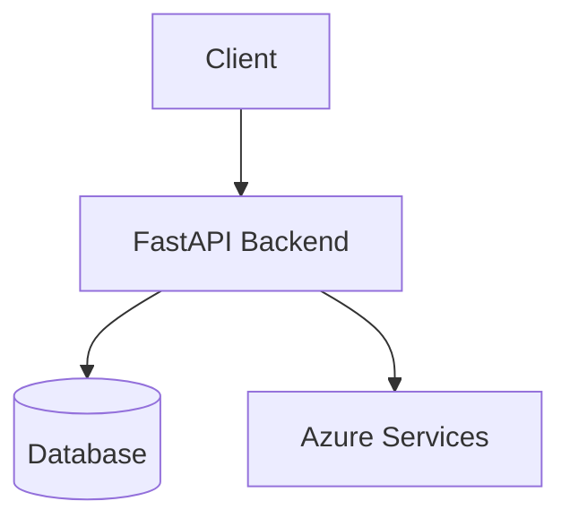

# Architecture

<!-- TODO: Replace this skeleton with project-specific architecture details. -->

## System Overview

## Components

| Component | Technology | Path |
|-----------|-----------|------|
| API | FastAPI | `src/template_repository/` |
| Infrastructure | Terraform | `infra/` |
| Tests | pytest | `tests/` |

## Data Flow

<!-- TODO: Describe request/response flow, async processing, event-driven patterns. -->

## Infrastructure

- **Provisioning:** Terraform under `infra/`, orchestrated by Azure Developer CLI (`azd`).
- **Remote state:** Azure Blob Storage (configured via `infra/provider.conf.json`).
- **Resource naming:** Deterministic via `azurecaf` provider with SHA-based resource token.
- **Modules:** Each Azure service in its own module under `infra/modules/`.

See [`docs/deployment.md`](docs/deployment.md) for deployment instructions.

## Detailed Documentation

| Document | Description |
|----------|-------------|
| [`docs/deployment.md`](docs/deployment.md) | Azure provisioning and deployment |
| [`docs/local-development.md`](docs/local-development.md) | Local setup and development workflow |
| [`docs/configuration-reference.md`](docs/configuration-reference.md) | Environment variables and Terraform variables |
